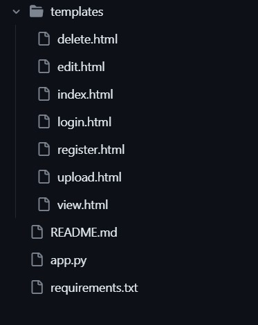
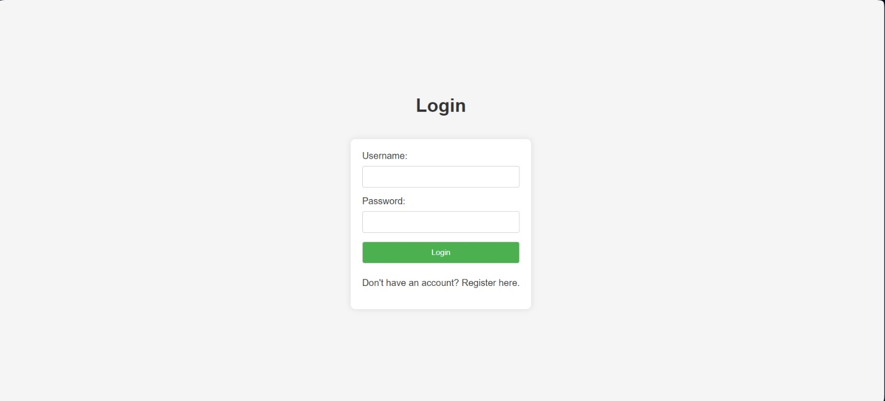
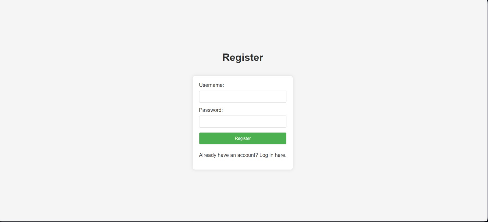
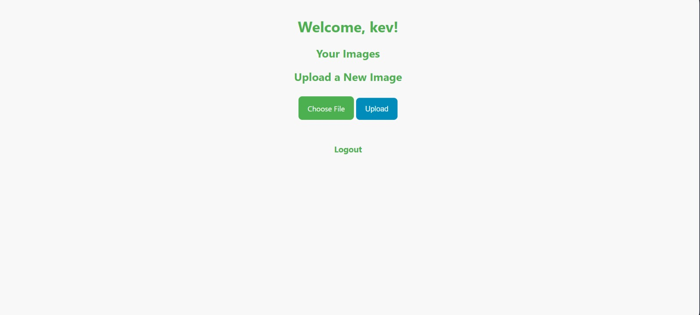
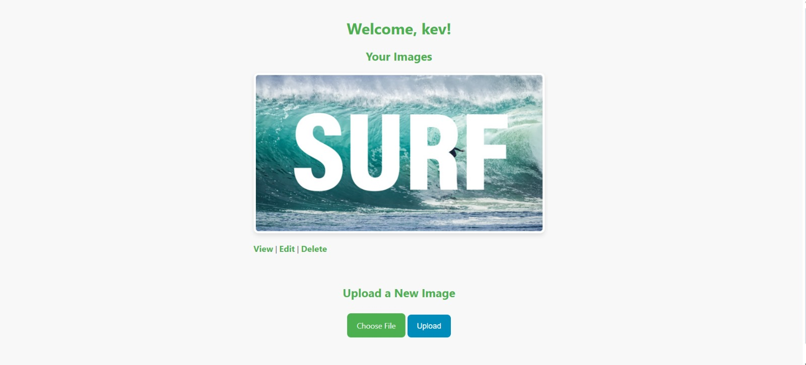
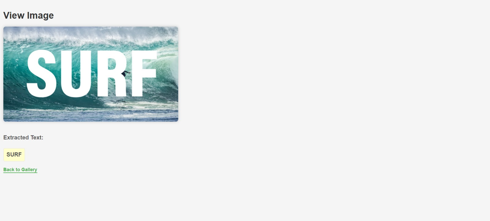
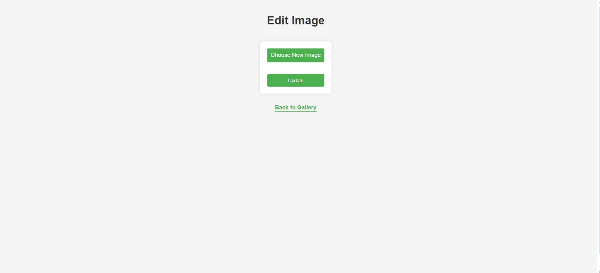

# Image Text Extractor Web Application

## About
The image text extractor implemented in the code is a web application built on Flask, allowing users to register, log in, and upload images for text extraction. Through the utilization of Google Cloud services, including Cloud Storage for image storage, BigQuery for user and image metadata storage, and Vision API for text extraction, the application offers a user-friendly interface for image management and processing. Users have the capability to upload, view, edit, and delete their images. The application seamlessly integrates with Google Cloud resources to store and retrieve both image content and associated textual information. The code demonstrates the implementation of secure user authentication, password handling, and effective communication with external cloud databases and APIs, providing a comprehensive solution for extracting text from images in a collaborative web environment.

## Prerequisites and Installation
1. **Python**
    - Install it if not already installed
2. **Google Cloud SDK**
    - Install the Google Cloud SDK
3. **Google Cloud Project**
    - Create a Google Cloud project and enable the necessary APIs (Cloud Storage, BigQuery, Vision API)
    - Install JSON key file for a service account with required permissions and set the environment variable `GOOGLE_APPLICATION_CREDENTIALS` to point to the downloaded key file
4. **Cloud Storage**
    - Create a Cloud Storage bucket where images are stored (Set `bucket_name`)
5. **BigQuery**
    - Create a BigQuery dataset and table for user and image information.
    - Create two tables, one for user(Username,Password) and another for images(filename,extracted_text, user_id).
6. **Dependencies**
    - Install Python dependencies on a virtual environment by running the following command in the project directory:
        ```bash
        sudo apt-get update
        sudo apt-get install python3.8-venv

        python3 -m venv venv
        source venv/bin/activate
        pip install -r requirements.txt
        ```

## Code Configuration
1. Open `app.py` in a text editor
2. Update the configurations:
    - Set a secure value for `app.config['SECRET_KEY']`
    - Update the path to your Google Cloud service account key file in `os.environ["GOOGLE_APPLICATION_CREDENTIALS"]`

## Running the Application
1. Open a terminal in the project directory
2. Run the following command to start the Flask application:
    ```bash
    python3 app.py
    ```
3. Visit [http://localhost:5000](http://localhost:5000) in your web browser

## Accessing the website
The project is deployed on GCP and can be accessed by using the link in your web browser: http://35.246.80.223:5000/

## Usage
1. Register with a new user
2. Log in with the registered user
3. Upload images for text extraction
4. View, edit, and delete uploaded images
5. Log out when done

## Important Notes
- Ensure the required Google Cloud services are enabled and properly configured
- It is recommended to run the application in a virtual environment to avoid conflicts with Python packages
- Code is configured for development (`debug=True`)
- Following these steps with the code running will allow the user to use the image text extraction web application locally

## Flask Application Structure


## System Architecture and Overview
### 1. Web Application Architecture
- The core of the application is built using Flask, a micro web framework for Python
- The Model-View-Controller (MVC) pattern is loosely followed, with routes handling user interactions, HTML templates managing views, and Python scripts handling the application logic

### 2. User Authentication
- User authentication is implemented using Flask-Login, allowing users to register, log in, and log out.
- User passwords are securely hashed using Flask-Bcrypt.

### 3. Google Cloud Services Integration
- Images are uploaded to and retrieved from a Google Cloud Storage bucket.
- The storage library is used to interact with Cloud Storage for image storage and retrieval.
- User and image metadata are stored in Google BigQuery
- The BigQuery library is used to execute SQL-like queries for user and image data management.
- Google Cloud Vision API is utilized for text extraction from uploaded images.
- The vision library is used to interact with the Vision API for image processing.

### 4. Flask Routes
- The application defines various routes for user interactions, including login, registration, image upload, image view, edit, and delete.
- Each route corresponds to a specific functionality, making the application modular and easy to extend.

### 5. Image Processing
- Uploaded images are processed using the Google Cloud Vision API to extract text.
- The `extract_text_from_image` function handles the upload of images to Cloud Storage and text extraction using the Vision API.

### 6. Database Management
- User information, including usernames and hashed passwords, is stored in BigQuery
- Image metadata, such as filenames and extracted text, is also stored in BigQuery.

### 7. Security Measures
- User passwords are securely hashed using the bcrypt library.
- Secure key management practices are implemented, such as keeping the Google Cloud service account key in a separate file.

### 8. Dependencies
- Required Python libraries and dependencies are specified in the `requirements.txt` file

### 9. Web Interface
- HTML templates are used to render views for user interactions, providing a user-friendly interface for image management.

### 10. Deployment Considerations
- The application is set to run in debug mode, suitable for development.
- In a production environment, additional configurations and security measures should be implemented.

## REST-based Service Interface for CRUD Operations
### 1. User Authentication
- **Endpoint:** `/login`, `/register`, `/logout`
- These endpoints handle user authentication. Users can log in, register, and log out using POST requests.

### 2. Image Management
- **Endpoints:**
    - `/upload` (POST): Handles image uploads.
    - `/view/<filename>` (GET): Retrieves details of a specific image.
    - `/edit/<filename>` (GET, POST): Retrieves and updates details of a specific image.
    - `/delete/<filename>` (GET): Deletes a specific image.
    - `/` (GET): Retrieves a list of images for the logged-in user.
- These endpoints manage CRUD operations for user-uploaded images. Users can upload, view, edit, and delete their images.

### 3. HTML Rendering
- **Endpoints:**
    - `/` (GET): Renders the main page with a list of user images.
    - `/login` (GET, POST): Renders the login page and handles login requests.
    - `/register` (GET, POST): Renders the registration page and handles registration requests.
    - `/upload` (GET): Renders the image upload page.
    - `/view/<filename>` (GET): Renders the page displaying details of a specific image.
    - `/edit/<filename>` (GET, POST): Renders the page for editing a specific image.
- These endpoints render HTML pages for user interfaces, integrating the application with a traditional web-based approach.

### 4. User Data
- **Endpoint:** `/view/<filename>`
- Retrieves user-specific image details, including filename, URL, and extracted text.

### 5. Image Text Extraction
- **Endpoint:** `/upload` (POST)
- Handles the upload of images and triggers the extraction of text using the Vision API. Extracted text and image metadata are stored in BigQuery.

## Application Overview
- Login page

- Register page

- Index page

- Uploaded image

- View page

- Edit page

- Users database (storing usernames and hashed password)

- Images database (storing filename, extracted text and userid)

